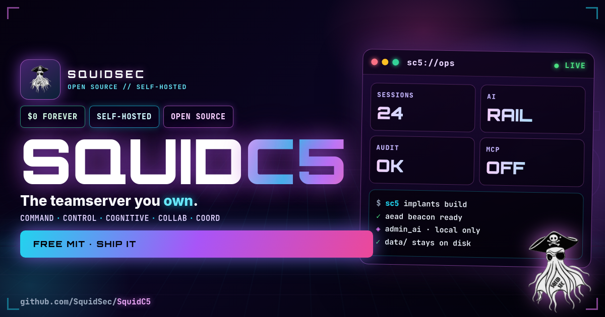

# SquidC5

<p align="center">
 <a href="https://github.com/SquidSec/SquidC5">
 
 </a>
</p>

<p align="center">
 <strong>A SquidSec Open Source Project</strong><br>
 <a href="https://squidoffense.com/">SquidOffense.com</a> /
 <a href="https://github.com/SquidSec/SquidC5">GitHub</a> /
 <a href="docs/README.md">Docs</a>
</p>

<p align="center">
 <!-- Private repo: GitHub/shields status APIs return "not found" unauthenticated - static link badges only -->
 <a href="https://github.com/SquidSec/SquidC5/actions/workflows/ci.yml"></a>
 <a href="https://github.com/SquidSec/SquidC5/actions/workflows/squidgate.yml"></a>
 <a href="https://github.com/SquidSec/SquidC5/releases"></a>
 <a href="https://www.python.org/downloads/"></a>
 <a href="LICENSE"></a>
</p>

**Command / Control / Cognitive / Collaborative / Coordination**

Security-first, AI-native C5 teamserver for **authorized** red team and penetration testing. Built by **[SquidSec](https://squidoffense.com/)**.

> **Authorized use only.** Unauthorized access is illegal.

### What C5 means

| Pillar | Role |
|--------|------|
| **Command** | Tasking shells, beacons, native implants |
| **Control** | Scoped tokens, policy, HITL, feature flags |
| **Cognitive** | INKO (Intelligent Neural Kinetic Operator) + sandboxed Admin AI + restricted MCP |
| **Collaborative** | Teams, handoff, per-operator audit |
| **Coordination** | Profiles, OAST, timeline, reports |

## Features

- **Scoped API tokens** + immutable audit hash chain (`sc5 audit-verify`)
- **Dual AI** - MCP off by default; **INKO** neural operator chat (connection + model switcher, railed tools) + Admin AI capabilities; optional local Ollama
- **Native implant** - `agents/sc5beacon` (Go): AEAD, sleep/jitter/kill/hours, files, SOCKS reverse-dial
- **Implant factory** - `sc5 implants build` / `POST /api/v1/implants/build`
- **Malleable C2 profiles** - Ops **Profiles** page; transforms (base64, prepend/append, xor, netbios) + profile push
- **Artifacts** - save/reuse payloads, custom templates, and generated assets in Ops
- **OAST Collaborator** - DNS / HTTP / SMTP out-of-band hit capture (`sc5 oast`)
- **TLS certificate library** - Admin PEM upload/activate (restart to serve)
- **SOCKS5 pivot** - operator proxy with **implant reverse-dial duplex** or direct mode
- **File ops** - `file:list|read|write|delete` (+ chunk offset/length)
- **Engagement ROE** - banned commands, end time, HITL file-write
- **Multi-op collab** - session claim/lock, handoff packs, spectator, presence, team chat, per-op audit
- **Ops console** - multi-page nav (Sessions, Listeners, Payloads, Profiles, Artifacts, Post-Ex, Collab, INKO, Observe, Admin), mobile drawer, **INKO** flyout, resizable dock
- **Secure defaults** - TLS on, empty CORS (no null), no public OpenAPI, admin.js gated, MCP scoped+HITL, implant AEAD on all listeners
- **Binary CI** - Linux/Windows server+CLI, native agents, SBOM

## Quick start (Docker lab)

```bash
docker compose up --build -d
curl -sk https://127.0.0.1:8443/api/v1/health
docker compose exec squidc5 cat /data/admin_token.txt
# Ops UI: https://127.0.0.1:8443/ops
```

## Quick start (local)

```bash
python3 -m venv .venv && source .venv/bin/activate
pip install -r requirements-dev.txt && pip install -e .
squidc5
# token: data/admin_token.txt
```

## Binaries

Every push to `master` builds and releases:

**https://github.com/SquidSec/SquidC5/releases/latest**

| Asset | Role |
|-------|------|
| `squidc5-linux-x64` | Teamserver |
| `sc5-linux-x64` | Operator CLI |
| `sc5beacon-*` (CI artifact) | Native implant |
| `SHA256SUMS.txt` / `sbom.cdx.json` | Integrity |

```bash
chmod +x squidc5-linux-x64 && ./squidc5-linux-x64
./sc5-linux-x64 login --url https://HOST:8443 --token sc5_... --insecure
```

Prod deploy: **binary only** from main CI. See [docs/deployment.md](docs/deployment.md).

## Operator CLI

```bash
sc5 login --url https://HOST:8443 --token sc5_... --insecure
sc5 sessions list
sc5 implants build --os linux --arch amd64 C2_HOST 8443
sc5 policy hitl list
sc5 audit-verify
sc5 backup ./backup.db
sc5 ai opsec_review --data "listeners on 443"
```

## Native beacon

```bash
cd agents/sc5beacon && go mod tidy && go build -o sc5beacon .
export SC5_URL="https://C2:8443/api/v1/implant/beacon"
export SC5_PSK="$(cat /path/to/data/implant_psk.txt)"
./sc5beacon # TLS verifies system CAs (use real cert or lab CA)
```

Docs: [agents/sc5beacon/README.md](agents/sc5beacon/README.md)

## API (selected)

| Area | Path |
|------|------|
| Health | `GET /api/v1/health` / `GET /api/v1/health/deep` |
| Implant build | `POST /api/v1/implants/build` |
| File ops | `POST /api/v1/files/op` |
| SOCKS | `POST /api/v1/pivot/socks` |
| Profile push | `POST /api/v1/profiles/{id}/push` |
| Engagement | `GET/PUT /api/v1/engagement` |
| HITL | `GET /api/v1/policy/hitl` |
| Audit verify | `GET /api/v1/audit/verify` |
| INKO chat (ops) | `POST /api/v1/ai/chat` / `GET /api/v1/ai/tools` |
| Admin AI capabilities | `POST /api/v1/ai/run` / `GET /api/v1/ai/status` |
| LLM connections | `GET/POST /api/v1/llm` / `PATCH /api/v1/llm/{id}` / `POST /api/v1/llm/models` |
| Assets / artifacts | `GET/POST/DELETE /api/v1/assets` |
| OAST | `POST /api/v1/oast/tokens` / `GET /api/v1/oast/hits` |
| TLS cert library | `GET/POST /api/v1/tls/certs` / activate |

Auth: `Authorization: Bearer <token>`. **No public OpenAPI** on the server.

## Documentation

Docs follow [Diátaxis](https://diataxis.fr/): tutorials & how-tos (runbook/deploy), reference (user guide + AGENTS), explanation (vision/threat model). Full catalog: [docs/README.md](docs/README.md).

| Doc | Link |
|-----|------|
| Docs index | [docs/README.md](docs/README.md) |
| User guide | [docs/user-guide.md](docs/user-guide.md) |
| Operator runbook | [docs/operator-runbook.md](docs/operator-runbook.md) |
| Deployment | [docs/deployment.md](docs/deployment.md) |
| Threat model | [docs/threat-model.md](docs/threat-model.md) |
| Vision | [docs/squidc5-vision.md](docs/squidc5-vision.md) |
| Roadmap 2026-2027 | [docs/roadmap-2026-2027.md](docs/roadmap-2026-2027.md) |
| Five-star program | [docs/roadmap-five-star.md](docs/roadmap-five-star.md) |
| Prod readiness | [docs/prod-readiness-plan.md](docs/prod-readiness-plan.md) |
| Changelog | [CHANGELOG.md](CHANGELOG.md) |
| Contributing | [CONTRIBUTING.md](CONTRIBUTING.md) |
| Security | [SECURITY.md](SECURITY.md) |
| Agents (CLI + AI memory) | [AGENTS.md](AGENTS.md) |

## Configuration

See [.env.example](.env.example). Prefix `SQUIDC5_`.

| Variable | Default | Notes |
|----------|---------|--------|
| `TLS_ENABLED` | `true` | HTTPS |
| `MCP_ENABLED` | `false` | External AI tools |
| `IMPLANT_REQUIRE_AUTH` | `true` | AEAD beacons |
| `LOCAL_LLM_ENABLED` | `false` | Opt-in Ollama path |
| `LOCAL_LLM_BASE_URL` | `http://127.0.0.1:11434/v1` | Ollama-compatible |
| `LOCAL_LLM_MODEL` | `llama3.2` | Model id when enabled |
| `RATE_LIMIT_PER_MINUTE` | `60` | Raise for ops UI (e.g. 600) |
| `PUBLIC_HOST` | empty | Stage-2 / SOCKS data host |

## Security model

1. Deny by default / scoped tokens / server-side HITL 
2. INKO / Admin AI: capability + chat-tool allow-lists, `sanitize_untrusted`, audited tool calls 
3. Implant AEAD / no skip-verify in native agent 
4. Audit chain + verify / engagement ROE 
5. [SquidGate](https://github.com/SquidSec/SquidGate) on PRs 

## Development

```bash
pytest -q
ruff check src tests
# optional: cd agents/sc5beacon && go build .
```

Git cycle: feature branch -> tests -> PR -> green CI -> merge `master`. Never push straight to master.

## About SquidSec

**[SquidSec](https://squidoffense.com/)** - U.S. veteran-owned security. 
Sister project: [SquidGate](https://github.com/SquidSec/SquidGate).

## License

MIT - [LICENSE](LICENSE).

## Disclaimer

For authorized security testing and education only. Authors are not responsible for misuse.
